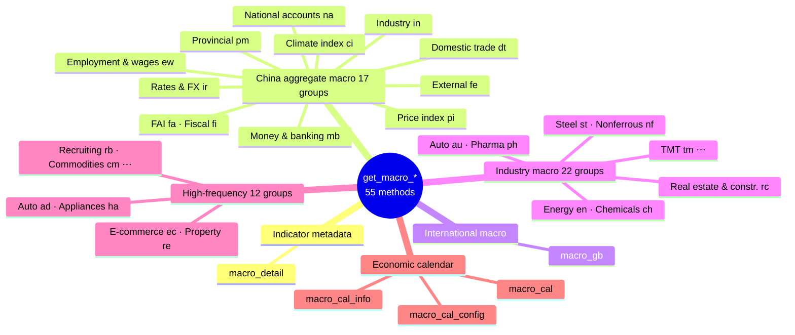
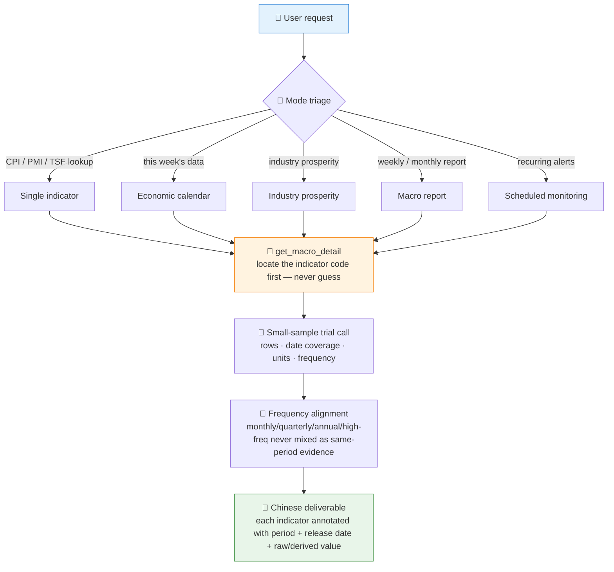

# 🏛️ Macro Monitor Skill

[简体中文](README.md) | **English**

> Routes requests like "look up CPI", "what economic data is out this week", or "how is steel-industry prosperity" to the right Pandadata `get_macro_*` interfaces, and outputs Chinese macro analysis and scheduled monitoring with explicit data-freshness annotations.

<p align="center">
  
  
  
  
  
  
  
</p>

---

## 📖 What is this

`macro-monitor` is an **Agent Skill** covering all **55 Pandadata macro interfaces** (17 China-macro groups + international macro + 22 industry groups + 12 high-frequency groups + 3 economic-calendar APIs). It supports five request modes — single-indicator lookup, economic calendar, industry prosperity, macro weekly/monthly reports, and scheduled monitoring.

The two biggest traps in macro data are **indicator codes and data freshness**: there are thousands of indicators whose codes cannot be guessed, and releases lag and get revised. This skill enforces "locate the code via `get_macro_detail` first, then call the data interface", and treats **data period + release date** as part of every answer — so stale data is never read as current.

> All data contracts come from the sibling skill [`pandadata-api`](https://github.com/quantskills/skill-pandadata-api).

---

## 🗂️ Data Domain Overview



---

## ⚡ Five Request Modes



| Mode | Output |
|---|---|
| 🔢 **Single indicator** | Latest value, previous value, YoY/MoM, recent trend, freshness check |
| 📅 **Economic calendar** | Release time, indicator, previous, consensus, importance, post-release follow-ups |
| 🏭 **Industry prosperity** | Demand / production / price / inventory / export / financing signals + high-frequency cross-checks |
| 📰 **Macro weekly/monthly** | Aggregates → prices → demand → money & credit → jobs & fiscal → industry high-freq → calendar; 11-part skeleton |
| ⏰ **Scheduled monitoring** | A YAML monitoring contract first (watchlist, triggers, timezone, output format); automation created only after confirmation |

---

## 🚀 Quick Start

### 1️⃣ Install (together with pandadata-api)

```bash
# Claude Code (global)
cp -r skill-pandadata-api ~/.claude/skills/pandadata-api
cp -r skill-macro-monitor ~/.claude/skills/macro-monitor
```

### 2️⃣ Ask in natural language

```text
最新的 CPI 和 PPI 是多少？处于近5年什么水平？
本周有哪些重要经济数据发布？
钢铁行业现在景气度怎么样？用高频数据验证一下
给我生成一份本月宏观月报
每周一早上8点半提醒我本周经济日历
```

### 3️⃣ Monitoring contract example

For recurring monitoring, the skill first produces a spec for you to confirm, then creates the real scheduled task:

```yaml
monitor_name: macro-weekly-calendar
timezone: Asia/Shanghai
schedule: every Monday 08:30
watchlist:
  - indicator: CPI
    data_method: get_macro_pi
    trigger: new_release_or_revision
  - indicator: 社会融资规模
    data_method: get_macro_mb
    trigger: new_release_or_revision
output:
  format: markdown
  sections: [upcoming_calendar, released_data_review, surprises, next_watchlist]
```

---

## 📦 Directory Layout

```
macro-monitor/
├── SKILL.md                          # Skill entry: core rules, workflow, method routing table
├── references/
│   └── macro-monitor-guide.md        # 📒 Full routing table, default windows, report skeletons, monitoring contract
└── agents/
    ├── cursor-rule.mdc               # Cursor rule adapter
    ├── openai.yaml                   # OpenAI/Codex adapter
    └── portable-loader.md            # Portable loader
```

---

## 📐 Core Constraints

| Constraint | Description |
|---|---|
| 🔑 Code before data | Indicator codes must come from `get_macro_detail` or the API docs; guessing codes from memory is forbidden |
| 🕐 Freshness is part of the answer | Every indicator carries its latest data period and release/update date; revisions are labeled "revised", not new data |
| 📅 Frequency alignment | Monthly/quarterly/annual/high-frequency series are never treated as same-period mutual evidence; async evidence is labeled |
| 🧮 Transparent derivation | When YoY/MoM is computed rather than returned, it is labeled `derived` with the formula |
| 🗣️ Restrained wording | Macro readings use "shows" / "may indicate" / "needs verification"; no deterministic investment conclusions |
| 🔕 No silent runs | Scheduled monitors output "no new data this period" instead of staying silent and being mistaken for success |

---

## ⚠️ Disclaimer

Reports are generated from public data and rule-based analysis, for research reference only. Nothing here constitutes investment advice.

## 📜 License

This project is licensed under the GNU General Public License v3.0. See [LICENSE](LICENSE).

## 🐼 PandaAI / QUANTSKILLS Community

<div align="center">
  
  <br>
  <sub>Scan the QR code to join the PandaAI community for QUANTSKILLS skills, agent workflows, and quantitative research practice.</sub>
</div>
