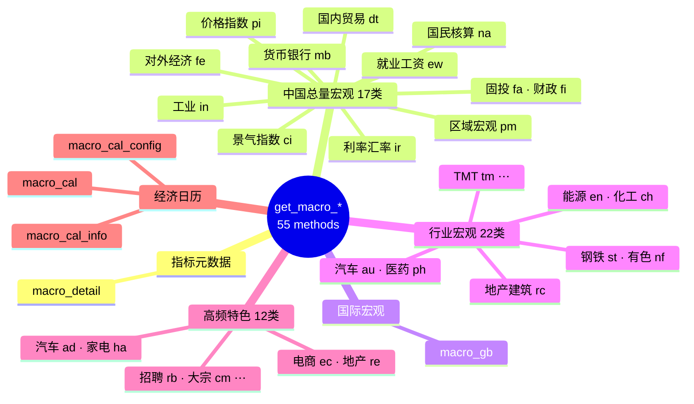
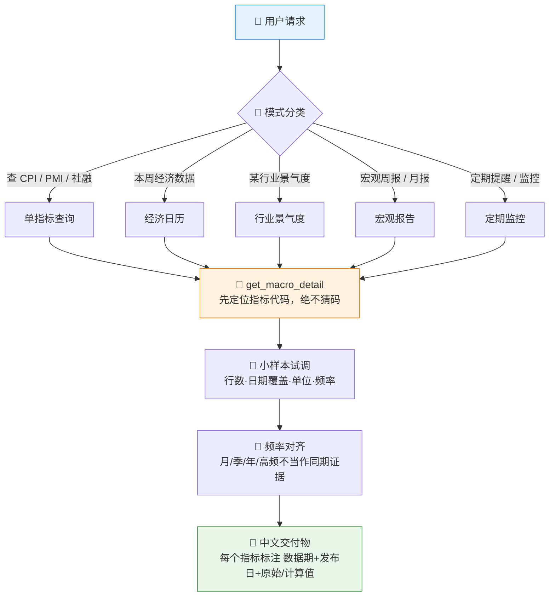

# 🏛️ Macro Monitor Skill

**简体中文** | [English](README.en.md)

> 把"查 CPI""本周有什么经济数据""钢铁行业景气度怎么样"这类请求，路由到正确的 Pandadata `get_macro_*` 接口，输出带数据时效标注的中文宏观分析与定期监控。

<p align="center">
  
  
  
  
  
  
  
</p>

---

## 📖 这是什么

`macro-monitor` 是一个 **Agent Skill**：覆盖 Pandadata 全部 **55 个宏观接口**（中国宏观 17 类 + 国际宏观 + 行业宏观 22 类 + 高频特色 12 类 + 经济日历 3 个），支持五种请求模式 —— 单指标查询、经济日历、行业景气度、宏观周报/月报、定期监控。

宏观数据最大的坑是**指标代码和数据时效**：指标成千上万、代码不可猜，且发布滞后、频繁修订。本技能强制"先 `get_macro_detail` 定位代码，再调数据接口"，并把**数据期 + 发布日期**作为答案的一部分，杜绝把旧数据当当期解读。

> 数据契约一律来自姊妹技能 [`pandadata-api`](https://github.com/quantskills/skill-pandadata-api)。

---

## 🗂️ 数据域总览



---

## ⚡ 五种请求模式



| 模式 | 输出 |
|---|---|
| 🔢 **单指标查询** | 最新值、前值、同比/环比、近期趋势、数据时效检查 |
| 📅 **经济日历** | 发布时间、指标、前值、预期值、重要度、发布后跟踪动作 |
| 🏭 **行业景气度** | 需求/生产/价格/库存/出口/融资信号拆分 + 高频数据交叉验证 |
| 📰 **宏观周报/月报** | 总量→价格→需求→货币信用→就业财政→行业高频→日历，11 段骨架 |
| ⏰ **定期监控** | 先产出 YAML 监控契约（指标清单、触发规则、时区、输出格式），确认后再建自动化任务 |

---

## 🚀 快速开始

### 1️⃣ 安装（与 pandadata-api 一起）

```bash
# Claude Code（全局）
cp -r skill-pandadata-api ~/.claude/skills/pandadata-api
cp -r skill-macro-monitor ~/.claude/skills/macro-monitor
```

### 2️⃣ 直接用自然语言提问

```text
最新的 CPI 和 PPI 是多少？处于近5年什么水平？
本周有哪些重要经济数据发布？
钢铁行业现在景气度怎么样？用高频数据验证一下
给我生成一份本月宏观月报
每周一早上8点半提醒我本周经济日历
```

### 3️⃣ 监控契约示例

要求定期监控时，技能会先产出规格让你确认，再创建真实定时任务：

```yaml
monitor_name: macro-weekly-calendar
timezone: Asia/Shanghai
schedule: every Monday 08:30
watchlist:
  - indicator: CPI
    data_method: get_macro_pi
    trigger: new_release_or_revision
  - indicator: 社会融资规模
    data_method: get_macro_mb
    trigger: new_release_or_revision
output:
  format: markdown
  sections: [upcoming_calendar, released_data_review, surprises, next_watchlist]
```

---

## 📦 目录结构

```
macro-monitor/
├── SKILL.md                          # 技能入口：核心规则、工作流、方法路由表
├── references/
│   └── macro-monitor-guide.md        # 📒 完整路由表、默认窗口、报告骨架、监控契约
└── agents/
    ├── cursor-rule.mdc               # Cursor 规则适配
    ├── openai.yaml                   # OpenAI/Codex 适配
    └── portable-loader.md            # 通用加载器
```

---

## 📐 核心约束

| 约束 | 说明 |
|---|---|
| 🔑 先定码再取数 | 指标代码必须来自 `get_macro_detail` 或接口文档，禁止凭记忆猜码 |
| 🕐 时效即答案 | 每个指标标注最新数据期、发布/更新日期；修订数据标注"修订"而非新数据 |
| 📅 频率对齐 | 月/季/年/高频数据不得当作同期相互印证，异步证据显式标注 |
| 🧮 计算透明 | 接口未返回同比/环比而自行计算时，标注 `计算值` 并给出公式 |
| 🗣️ 措辞克制 | 宏观解读用"显示""可能提示""需要验证"，不下确定性投资结论 |
| 🔕 监控防静默 | 定期监控空跑时输出"本期无新数据"，避免静默被误认为发布成功 |

---

## ⚠️ 免责声明

本报告基于公开数据与规则化分析生成，仅供研究参考，不构成任何投资建议。

## 📜 License

This project is licensed under the GNU General Public License v3.0. See [LICENSE](LICENSE).
